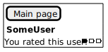
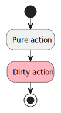
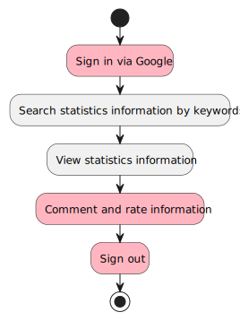

# Об этом документе

В этом документе представлено решение домашнего задания «Паттерны декомпозиции микросервисов» курса «Microservice Architecture» 25 декабря 2023 года — 29 июня. Ниже — краткое описание задания.

> Цель:  
> В этом ДЗ вы разделите ваше приложение на несколько микросервисов с учетом будущих изменений.  
> Описание/Пошаговая инструкция выполнения домашнего задания:  
> Попробуйте сделать несколько вариантов разбиений и попробуйте их оценить. Выберите вариант, который вы будете реализовывать.  
> На выходе вы должны предоставить  
>     1. Пользовательские сценарии  
>     2. Общую схему взаимодействия сервисов.  
>     3. Для каждого сервиса опишите назначение сервиса и его зону ответственности.  
>     4. Опишите контракты взаимодействия сервисов друг с другом.  
> Критерии оценки:  
> "Принято" - задание выполнено полностью  
> "Возвращено на доработку" - задание не выполнено полностью  
> Рекомендуем сдать до: 11.02.2024  

## Как менять картинки

Чтобы поменять картинки PlantUML, следует воспользоваться советом со страницы ["How to use PlantUML with Markdown"](https://gist.github.com/noamtamim/f11982b28602bd7e604c233fbe9d910), то есть обновить код PlantUML в тексте этого документа и запустить `plantuml.jar -tsvg "readme.md"`.

# Предметная область, назначение продукта

Продукт выполняет роль наполняемой пользователями базы данных со статистической информацией. Речь идёт, например, об ожидаемой продолжительности жизни, о населении, о потреблении электроэнергии. Эта информация представляется в нескольких разрезах, например, в зависимости от года, в зависимости от страны. Продукт, на который мы ориентируемся — сайт [ourworldindata.org](https://ourworldindata.org/), вот снимок экрана для иллюстрации идеи:

В отличие от указанного образца, наш продукт наполняется самими пользователями по принципу «Википедии». При добавлении информации пользователь указывает источник, из которого он берёт эту информацию.

# Глоссарий

- Пользователь — агент (обычно человек), заинтересованный в использовании продукта. В начале работы с продуктом это анонимный пользователь.
- Пользователь может представиться для продукта с помощью внешней системы аутентификации, например, с помощью своей УЗ Google.
- Продукт (сайт, система) — обсуждаемый в данном документе продукт, выполняющий указанное выше назначение.
- Учётная запись (УЗ) — ассоциируемый с пользователем продукта идентификатор.

# Макеты

## Главная страница для анонимного пользователя

<!--
@startsalt mockup-1-main-anonymous
{+
  [Sign in via Google]
  { "                  " | [Search] }
}
@endsalt
-->

## Главная страница для представившегося пользователя

<!--
@startsalt mockup-2-main-signedin
{+
  { [Upload CSV] | SomeUser | [Sign out] }
  { "                  " | [Search] }
}
@endsalt
-->

## Страница каталога

<!--
@startsalt mockup-3-catalog
{+
  [Main page]
  { "Life              " | [Search] }
  Life Expectancy (UN 2010) (Uploaded by SomeUser)
  Happiness and Life Satisfaction (Researcher, Scientist et al.) (Uploaded by AnotherUser)
}
@endsalt
-->

## Страница со статистической информацией

<!--
@startsalt mockup-4-statistics
{+
  [Main page]
  <b>Life Expectancy
  
  Reference: UN 2010, pp. 10-14
  Uploaded by: SomeUser, 01 Jan. 2024 10:01
  { <b> SomeUser | 01 Jan. 2024 12:34 | <&battery-full><&battery-full><&battery-full> }
  This is a very useful information.
  { <b> AnotherUser | 02 Jan. 2024 13:57 | <&battery-full><&battery-empty><&battery-empty> }
  Not mentioned in the referenced document.
  {^"Rate this information"
	  Rating  | <&battery-full><&battery-empty><&battery-empty>
	  Comment | "         "
	  [Rate]
	}
}
@endsalt
-->

## Страница подтверждения загрузки

<!--
@startsalt mockup-5-confirmupload
{+
  { [Confirm] | [Cancel] }
  {
    Information caption | "My sample data"
    Reference           | "              "
	Qualification       | "              "
  }
}
@endsalt
-->

## Страница пользователя

<!--
@startsalt mockup-6-user
{+
  { [Main page] }
  <b> SomeUser
  You rated this user: <&battery-full><&battery-empty><&battery-empty>
}
@endsalt
-->

# Пользовательские истории и сценарии

Во всех сценариях предполагается, что пользователь взаимодействует с продуктом с помощью личного устройства (компьютера или телефона) через интернет-обозреватель. Пользователь взаимодействует с продуктом обычными для интернет-сайтов способами: перемещает курсор мыши, нажимает кнопки на сайте, вводит текст, прокручивает страницу в нужные стороны и т. п.

## История: Пользователь может искать представленную на сайте статистическую информацию

Как пользователь,  
Чтобы найти интересующую меня статистическую информацию,  
Я хочу получать список со статистической информацией по заданным ключевым словам.  

### Сценарий 1: Пользователь ищет статистическую информацию по ключевым словам

Дано то, что на сайте присутствует статистическая информация с названиями «Life Expectancy», «Population», «Happiness and Life Satisfaction»,  
И я вижу главную страницу.  
Когда я ввожу в строке поиска слово «Life» и нажимаю на кнопку поиска,  
Тогда я вижу страницу каталога и список со ссылками на «Life Expectancy» и «Happiness and Life Satisfaction»,  
И у каждой ссылки указан источник и пользователь, загрузивший информацию.  

## История: Пользователь может посмотреть выбранную статистическую информацию

Как пользователь,  
Чтобы проанализировать интересующую меня статистическую информацию,  
Я хочу видеть графическое представление информации, её метаданные и обсуждение.  

### Сценарий 1: Пользователь смотрит выбранную статистическую информацию

Дано то, что на сайте присутствует статистическая информация с названиями «Life Expectancy», «Population», «Happiness and Life Satisfaction»,  
И пользователи ранее оставляли отзывы об информации «Life Expectancy»,  
И я вижу страницу каталога,  
И я вижу список со ссылками на «Life Expectancy» и «Happiness and Life Satisfaction».  
Когда я нажимаю на ссылку на «Life Expectancy»,  
Тогда я вижу страницу со статистической информацией «Life Expectancy» и её графическим представлением,  
И на этой странице указан источник с уточнением и пользователь, загрузивший информацию,  
И на этой странице показаны отзывы пользователей об этой информации.  

## История: Пользователь может представляться с помощью Google

Как анонимный пользователь,  
Чтобы иметь возможность добавлять в продукт информацию, оценивать уже загруженную информацию и других пользователей,  
Я хочу представляться в продукте с помощью УЗ Google.  

### Сценарий 1: Анонимный пользователь начинает представляться с помощью УЗ Google

Дано то, что я — анонимный пользователь  
И я нахожусь на главной странице.  
Когда я нажимаю кнопку «Sign in via Google»,  
Тогда я вижу интерфейс Google для входа в продукт  
И могу представиться с помощью средств Google.  

### Сценарий 2: Анонимный пользователь заканчивает представляться с помощью УЗ Google

Дано то, что я — анонимный пользователь  
И я вижу интерфейс Google для входа в продукт,  
И я согласился представиться с помощью УЗ Google.  
Когда я заканчиваю представляться с помощью средств Google,  
Тогда я вижу страницу продукта со своим идентификатором Google и кнопкой «Sign out».  

### Сценарий 3: Представившийся пользователь становится анонимным

Дано то, что я — пользователь, представившийся с помощью УЗ Google  
И я нахожусь на главной странице.  
Когда я нажимаю на кнопку «Sign out»,  
Тогда я вижу страницу продукта с кнопкой «Sign in via Google».  

## История: Пользователь может добавить на сайт статистическую информацию

Как представившийся пользователь,  
Чтобы добавить на сайт статистическую информацию,  
Я хочу загрузить информацию в виде файла CSV.  

### Сценарий 1: Пользователь выбирает файл для загрузки на сайт

Дано то, что я — представившийся пользователь  
И я вижу главную страницу.  
Когда я нажимаю на кнопку «Upload CSV»,  
Тогда я вижу стандартный системный диалог для выбора файла.  

### Сценарий 2: Пользователь загружает файл

Дано то, что я — представившийся пользователь  
И с помощью стандартного системного диалога я нашёл файл CSV, называющийся «My sample data.csv», содержимое которого правильно с точки зрения продукта.  
Когда я выбираю этот файл для загрузки,  
Тогда я вижу страницу подтверждения загрузки, где меня просят указать название информации,  
И где меня просят указать источник этой информации в виде названия документа и места в этом документе,  
И где есть кнопки «Confirm» и «Cancel».  

### Сценарий 3: Пользователь заканчивает загружать информацию

Дано то, что я — представившийся пользователь  
И я до этого выбрал файл CSV для загрузки,  
И я вижу страницу подтверждения загрузки,  
И название информации заполнено,  
И название источника заполнено.  
Когда я нажимаю кнопку «Proceed»,  
Тогда я вижу страницу со статистической информацией из выбранного файла CSV.  

### Сценарий 4: Пользователь прекращает загружать информацию

Дано то, что я — представившийся пользователь  
И я вижу страницу подтверждения загрузки.  
Когда я нажимаю кнопку «Cancel»,  
Тогда я вижу главную страницу.  

## История: Пользователь оценивает информацию

Как представившийся пользователь,  
Чтобы оценить ранее загруженную кем-либо статистическую информацию,  
Я хочу оставить отзыв об этой информации  

### Сценарий 1: Пользователь оставляет отзыв об информации

Дано то, что я — представившийся пользователь  
И я вижу страницу со статистической информацией,  
И на этой странице есть форма для отзыва,  
И в форме для отзыва указан рейтинг и заполнен комментарий.  
Когда я нажимаю кнопку «Rate»,  
Тогда я вижу страницу с этой же информацией,  
И на этой странице показан мой рейтинг и мой комментарий.  

## История: Пользователь оценивает другого пользователя

Как представившийся пользователь,  
Чтобы делегировать проверку статистической информации другим доверенным пользователям,  
Я хочу составлять личный рейтинг других пользователей.  

### Сценарий 1: Пользователь попадает на страницу другого пользователя

Дано то, что я — представившийся пользователь с идентификатором SomeUser  
И я вижу страницу со статистической информацией,  
И на этой странице написано, что данную информацию загрузил пользователь с идентификатором AnotherUser,  
И до этого я не оценивал пользователя AnotherUser.  
Когда я нажимаю на AnotherUser,  
Тогда я вижу страницу пользователя AnotherUser,  
И на этой странице показан идентификатор этого пользователя (AnotherUser), приглашение оценить его и кнопка возврата на главную страницу.  

### Сценарий 2: Пользователь оценивает пользователя

Дано то, что я — представившийся пользователь с идентификатором SomeUser  
И я вижу страницу пользователя AnotherUser.  
Когда я указываю рейтинг этого пользователя,  
Я вижу страницу пользователя AnotherUser,  
И на этой странице написан указанный мной рейтинг.  

# Модель предметной области и системные действия

Здесь вкратце воспроизведены пользовательские истории и сценарии для того, чтобы, анализируя существительные и глаголы, построить модель предметной области и системных действий.

- Пользователь видит ссылки на статистическую информацию по запросу.
- Пользователь видит статистическую информацию, её источник и уточнение (место в источнике).
- Пользователь видит, кто и когда загрузил статистическую информацию.
- Пользователь видит отзывы (рейтинги и комментарии) других пользователей об информации.
- У пользователя может быть идентификатор УЗ Google.
- Пользователь может представляться в продукте с помощью УЗ Google и снова становиться анонимным.
- Представившийся пользователь начинает добавлять статистическую информацию с помощью подготовленного файла CSV.
- Представившийся пользователь заканчивает добавлять статистическую информацию, указав её источник и уточнение (место в источнике).
- Представившийся пользователь прекращает добавлять информацию.
- Представившийся пользователь оставляет отзыв (рейтинг и комментарий) об информации.
- Представившийся пользователь оценивает другого пользователя.

## Системные действия

В таблице ниже перечислены действия, которыми пользователь может взаимодействовать с системой. Схематически любое действие представляется следующим образом:

<!--
@startuml usecase-0-schema

User -> (Product) : SystemAction(arguments...)

@enduml
-->

| Действие              | Аргументы                     |
| --------------------- | ----------------------------- |
| SearchStatistics      | searchString                  |
| GetStatistics         | statisticsId                  |
| GetStatisticsRating   | statisticsId                  |
| SignInViaGoogle       |                               |
| SignOut               |                               |
| UploadStatisticsAsCsv | file                          |
| ConfirmUpload         | caption, reference            |
| GoToMainPage          |                               |
| RateStatistics        | statisticsId, rating, comment |
| RateUser              | userId, rating                |

## Модель предметной области

В предметной области выделены следующие сущности.
1. User – представившийся в системе пользователь.
1. UserRating – оценка представившегося пользователя другим представившимся пользователем.
1. StatisticsRating – оценка информации представившимся пользователем.
1. Statistics – метаданные о статистической информации.
1. StatisticsPoint – точка, описывающаяся годом и значением.
1. Tag – метка, соответствующая одному измерению.
1. TagValue – значение метки.
1. Source – источник, из которого взята статистическая информация.

<!--
@startuml domainmodel-1-all

entity UserRating {
	int Rating
}
entity User {
	string UserFriendlyIdentifier
}
entity Source {
	string UserFriendlyIdentifier
}
entity StatisticsRating {
	int Rating
	string Comment
	DateTime DatePosted
}
entity Statistics {
	string Caption
	string SourceReferenceQualification
	DateTime DateUploaded
}
entity StatisticsPoint {
	int Year
	double Value
}
entity TagValue {
	string Value
}
entity Tag {
	string Caption
}

UserRating "*" }- "2" User
User --{ Statistics
User -{ StatisticsRating
StatisticsRating }-- Statistics
Statistics }- Source
Statistics --{ StatisticsPoint
Statistics --{ Tag
StatisticsPoint }-{ TagValue
TagValue }- Tag

@enduml
-->

# Разбиение системы на микросервисы

## Разбиение по агрегатам

В предметной области выделено 4 агрегата, содержащие следующие сущности.

1. Users – пользователи.
    1. User – представившийся в системе пользователь.
    1. UserRating – оценка представившегося пользователя другим представившимся пользователем.
1. Discussion – обсуждение.
    1. StatisticsRating – оценка информации представившимся пользователем.
1. StatisticsData – статистические данные.
    1. Statistics – метаданные о статистической информации.
    1. StatisticsPoint – точка, описывающаяся годом и значением.
    1. Tag – метка, соответствующая одному измерению.
    1. TagValue – значение метки.
1. Sources – источники.
    1. Source – источник, из которого взята статистическая информация.

<!--
@startuml domainmodel-2-aggregates

package Users <<Cloud>> {
	entity UserRating {
		int Rating
	}
	entity User {
		string UserFriendlyIdentifier
	}
}
package Sources <<Cloud>> {
	entity Source {
		string UserFriendlyIdentifier
	}
}
package Discussion <<Cloud>> {
	entity StatisticsRating {
		int Rating
		string Comment
		DateTime DatePosted
	}
}
package StatisticsData <<Cloud>> {
	entity Statistics {
		string Caption
		string SourceReferenceQualification
		DateTime DateUploaded
	}
	entity StatisticsPoint {
		int Year
		double Value
	}
	entity TagValue {
		string Value
	}
	entity Tag {
		string Caption
	}
}

UserRating "*" }- "2" User
User --{ Statistics
User -{ StatisticsRating
StatisticsRating }-- Statistics
Statistics }- Source
Statistics --{ StatisticsPoint
Statistics --{ Tag
StatisticsPoint }-{ TagValue
TagValue }- Tag

@enduml
-->

Из разбиения модели предметной области на агрегатам получается, что систему следует разбить на следующие микросервисы:
- пользователи;
- обсуждение;
- статистические данные;
- источники.

## Функциональная модель

На диаграммах деятельности (активности) будем показывать действия, меняющие состояние системы, розовым цветом:

<!--
@startuml activity-0-legend
start
:Pure action
#lightpink:Dirty action
stop
@enduml
-->

Рассмотрим следующие действия предметной области.

### Пользователь оценивает статистическую информацию

<!--
@startuml activity-1-signin-search-view-eval
start
#lightpink:Sign in via Google;
:Search statistics information by keywords;
:View statistics information;
#lightpink:Comment and rate information;
#lightpink:Sign out;
stop
@enduml
-->

Микросервисы:
- вход и выход с помощью Google;
- поиск статистической информации по ключевым словам;
- просмотр информации;
- комментирование и оценка информации.

### Пользователь оценивает другого пользователя

<!--
@startuml activity-2-signin-search-view-user-eval
start
#lightpink:Sign in via Google;
:Search statistics information by keywords;
:View statistics information;
:View page of the user uploaded the information;
#lightpink:Rate user;
stop
@enduml
-->

Микросервисы:
- вход и выход с помощью Google;
- поиск статистической информации по ключевым словам;
- просмотр информации;
- просмотр страницы пользователя;
- оценка пользователя.

### Пользователь загружает информацию

<!--
@startuml activity-3-signin-upload
start
#lightpink:Sign in via Google;
#lightpink:Upload statistics information as CSV-file;
#lightpink:Set caption and source of the information;
stop
@enduml
-->

Микросервисы:
- вход с помощью Google;
- загрузка информации в виде файла CSV;
- указание названия и источника информации.

### Итоги разбиения с помощью функциональной модели

Из функциональной модели продукта следует, что систему следует разбить на следующие микросервисы:
- вход и выход с помощью Google;
- поиск статистической информации по ключевым словам;
- просмотр информации;
- комментирование и оценка информации;
- просмотр страницы пользователя;
- оценка пользователя;
- загрузка информации в виде файла CSV;
- указание названия и источника информации.

## Разбиение по транзакциям

Для разбиения продукта на микросервисы по транзакциям воспользуемся диаграммами функциональной модели продукта (приведены в соответствующем разделе этого документа). Будем считать, что каждый микросервис охватывает либо последовательность «чистых» действий (то есть только чтений — действий, не изменяющих состояние и данные системы), либо одно «грязное» действие (то есть потенциальных записей). Получаются следующие группы.

- Sign in via Google.
- Search statistics information by keywords; View statistics information.
- Comment and rate information.
- Sign out.
- Search statistics information by keywords; View statistics information; View page of the user. uploaded the information.
- Rate user.
- Upload statistics information as CSV-file.
- Set caption and source of the information.

Таким образом, с учётом транзакций систему следует разбить на следующие микросервисы:
- вход и выход с помощью Google;
- поиск статистической информации по ключевым словам, просмотр информации, просмотр страницы пользователя;
- комментирование и оценка информации;
- оценка пользователя;
- загрузка информации в виде файла CSV;
- указание названия и источника информации.

# API и описание сервисов

В качестве основы для моделирования выберем разбиение системы на микросвервисы по агрегатам. Поставим им в соответствие следующие системные действия.

**Пользователи**
- POST /users/signInViaGoogle
- POST /users/signOut
- POST /users/rate {userId, rating}

**Обсуждение**
- GET /discussion/getStatisticsRating {statisticsId}
- POST /discussion/rateStatistics {rating, comment}

**Статистические данные**
- GET /statistics/search?q={keywords}
- GET /statistics/{statisticsId}/
- GET /statistics/goToMainPage/
- POST /statistics/uploadStatisticsAsCsv {file}
- POST /statistics/confirmUpload {caption, reference}

**Источники**
- GET /sources/search?q={keywords}
- POST /sources/ {caption}

## Описание сервисов

Здесь рассмотренные микросервисы представлены в виде текста, аналогичного карточкам Microservices Canvas.

### Пользователи

**Название**: Пользователи
**Зависимости**
- Служба аутентификации Google (внешняя зависимость)
**Запросы и команды**
- POST /users/signInViaGoogle
- POST /users/signOut
- POST /users/rate {userId, rating}
**Подписки на события**
**Публикуемые события**

### Обсуждение

**Название**: Обсуждение
**Зависимости**
- Пользователи
- Статистические данные
**Запросы и команды**
- GET /discussion/getStatisticsRating {statisticsId}
- POST /discussion/rateStatistics {rating, comment}
**Подписки на события**
**Публикуемые события**

### Статистические данные

**Название**: Статистические данные
**Зависимости**
- Пользователи
- Источники
**Запросы и команды**
- GET /statistics/search?q={keywords}
- GET /statistics/{statisticsId}/
- GET /statistics/goToMainPage/
- POST /statistics/uploadStatisticsAsCsv {file}
- POST /statistics/confirmUpload {caption, reference}
**Подписки на события**
**Публикуемые события**

### Источники

**Название**: Источники
**Зависимости**
**Запросы и команды**
- GET /sources/search?q={keywords}
- POST /sources/ {caption}
**Подписки на события**
**Публикуемые события**
